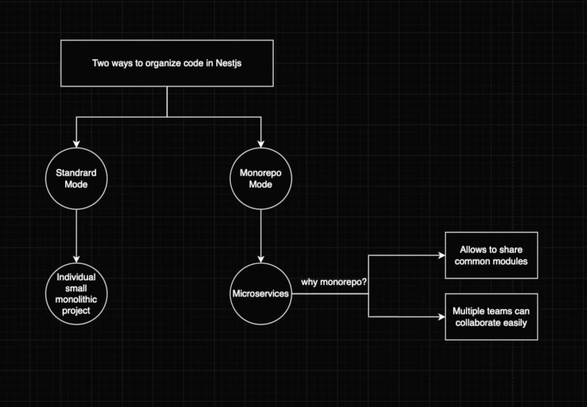
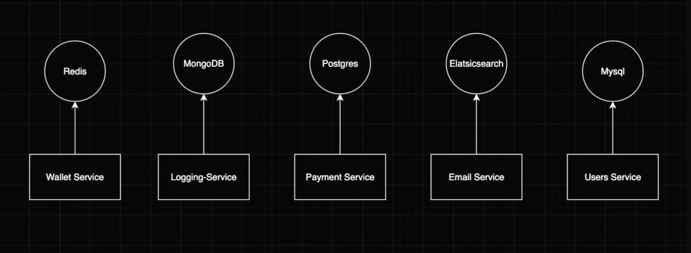
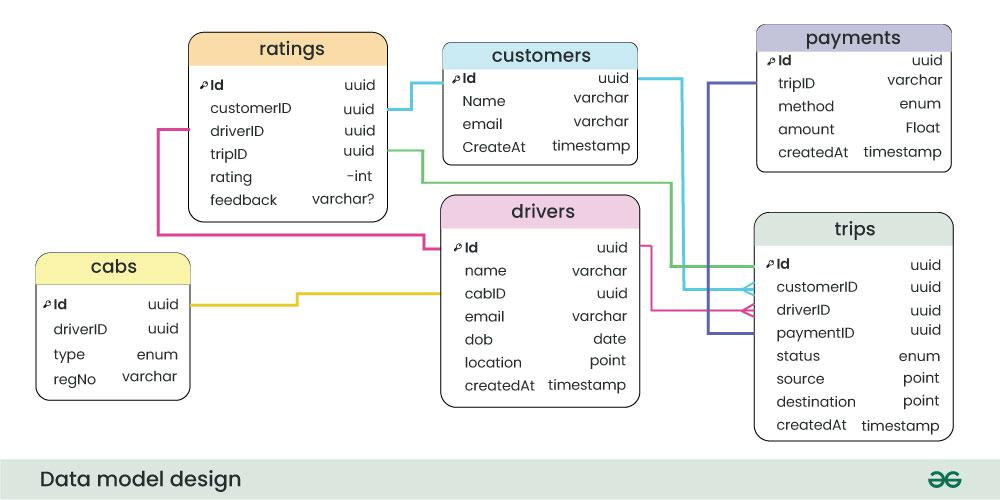

# Nest.js Fundamental

## If not installed then install Nest CLI (the magic of Nest.js)

    npm install -g @nextjs/cli

## Create new project (if Nest CLI already installed)

    nest new <project-name>
    cd <project-name>

    # Run application in Watch mode
    npm run start --watch 

## Create micro-services using mono-repo

    nest generate app talasca
    nest generate app auth
    nest generate app driver
    nest generate app rider

    # Then change port for each services, i.e. 3001, 3002, 3003, 3004 etc.

## Run a specific service

    npm run start auth

## Each Services can have different database

## Add docker-compose.yml to run MongoDB in Docker container
Create a file named `docker-compose.yml` in root

Add the following for MongoDB

    version: "3.1"

    services:
    mongo:
        image: mongo:latest
        container_name: mongo_talasca
        restart: always
        environment:
        MONGO_INITDB_ROOT_USERNAME: root
        MONGO_INITDB_ROOT_PASSWORD: 12345678
        ports:
        - "27017:27017"
        volumes:
        - mongo_data:/data/db

    volumes:
    mongodb_data:
        driver: local # The named volume

To run the MongoDB inside container, run

    docker compose up

    # To stop
    docker compose down

## Adding Prisma to application

    npm i -D prisma

    # Prisma Init
    npx prisma init

## Add `DATABASE_URL` to the `.env` file

    DATABASE_URL="mongodb://localhost:27017/db_name"

## Sample ERD of Talasca

## Update Schema  `prisma/schema.prisma`

Change the provider from `prisma-client` to `prisma-client-js` and comment `output....` line. That's how the generated Prisma client will be inside `node_modules/@prisma/client`, so it can be imported as `import { PrismaClient } from '@prisma/client'`

    ...
    generator client {
        provider = "prisma-client-js"
        // output   = "../../../node_modules/@prisma/client"
    }

Then add Schema

    enum UserRole {
        ADMIN
        MODERATOR
        DRIVER
        RIDER
    }

    model User {
        id        String @id @default(auto()) @map("_id") @db.ObjectId
        email     String @unique
        name      String?
        role      UserRole[] @default([RIDER])
        createdAt DateTime @default(now())
        updatedAt DateTime @updatedAt
    }

## Configure Prisma to work in Monorepo
Since the folder structure something like `root/apps/service1, root/apps/service2` and schema can be under `root/apps/service1/prisma/schema.prisma` and the `.env` file can be under `root/apps/service1/.env` then Prisma will fail to locate the `.env` file. We need to assign the `.env` file in Script.

### First need to install `dotenv-cli` globally in the project

    npm install --save-dev dotenv-cli

Update `root/package.json` scripts:

    {
        "scripts": {
            "prisma:generate": "dotenv -e ./apps/service1/.env -- prisma generate --schema=./apps/service1/prisma/schema.prisma",
            "prisma:push": "dotenv -e ./apps/service1/.env -- prisma db push --schema=./apps/service1/prisma/schema.prisma",
            "prisma:migrate": "dotenv -e ./apps/service1/.env -- prisma migrate dev --schema=./apps/service1/prisma/schema.prisma"
        }
    }

Now, Prisma CLI will load your .env correctly.

For runtime (Nest.js app startup)

In the  Nest.js app entry file, e.g. `/apps/service1/src/main.ts`:

    ...

    import * as dotenv from 'dotenv';
    import { join } from 'path';

    async function bootstrap() {
        // Load .env manually from parent directory
        dotenv.config({ path: join(__dirname, '../.env') });
        ...
    }
    void bootstrap();

This ensures process.env.DATABASE_URL is available when the Nest.js app runs —
so the Prisma Client will work correctly.

    # Now, Push database to MongoDB
    npm run prisma:push     # Script from the package.json file

This should push all documents to the MongoDB database

## Now generate Prisma Client in `node_modules/@prisma/client`

Modify the  

    npm run prisma:generate # From package.json Script.

and then

    npm install @prisma/client prisma

## Let's create Prisma service to use in the project

    nest g module src/prisma
    nest g service src/prisma

    # on module

    import { Module } from '@nestjs/common';
    import { PrismaService } from './prisma.service';

    @Module({
        providers: [PrismaService],
        exports: [PrismaService],
    })
    export class PrismaModule {}

    # on service

    import { Injectable, OnModuleInit } from '@nestjs/common';
    import { PrismaClient } from '@prisma/client';

    @Injectable()
    export class PrismaService extends PrismaClient implements OnModuleInit {
        onModuleInit() {
            this.$connect()
            .then(() => console.log('Connected to the MongoDB server!'))
            .catch((err:any) => console.log(err));
        }
    }

Now that we successfully created Prisma Module and Service we need to add this service as aprovider in our main Module i.e. `auth.module.ts`

    import { PrismaModule } from './prisma/prisma.module';
    @Module({
        imports: [..., PrismaModule],
        controllers: ...,
        providers: ...,
    })

## Running service
We can run our service now to check if the service successfully can connect to the MongoDB server or not:

    # Run service1 with it's service name
    npm run start:dev <service1>

We should see a log in the console like `"Connected to the MongoDB server!"`

## Inject the Prisma service to the woriking service
To use the Prisma service we now need to inject the Prisma service in our woriking service.

    import { PrismaService } from './prisma/prisma.service';

    @Injectable()
    export class AuthService {
        constructor(private prisma: PrismaService) {}
        ...
    }

## Use Prisma in service 
Now we can use all the ORM function in our service, i.e. in `auth.service.ts`

    import { Prisma } from '@prisma/client';

    createUser(data: Prisma.UserCreateInput) {
        return this.prisma.user.create({ data });
    }

We can now create DTOs to validate our request input. Install class validator package.

    npm i class-validator
    npm i class-transformer

## Run MongoDB in local computer as replicaset (Prisma Requirements)

    brew services stop mongodb-community

    # Edit the MongoDB config file
    nano /usr/local/etc/mongod.conf

    # Now add this block at the bottom (or update if already exists):
    replication:
      replSetName: "rs0"

Then save and exit.

Step 3: Start MongoDB again

    brew services start mongodb-community

    # Initialize the replica set
    mongosh

    # Inside the shell run
    rs.initiate()

    # Should see some output like
    {
        info2: 'no configuration specified. Using a default configuration for the set',
        me: '127.0.0.1:27017',
        ok: 1
    }

    # Check status 
    rs.status()

    # It shows something like
    {
        "set" : "rs0",
        "members" : [ { "_id" : 0, "stateStr" : "PRIMARY" } ],
        ...
    }

    # Run Prisma Generate again
    npm run prisma:generate

    # Start service
    npm run start:dev auth

That means the replica set is working.

## Adding data into MongoDB using REST API

    POST http://localhost:3001/auth/user

    Example Body JSON

    {
        "email": "mr.noorbd@gmail.com",
        "name": "Siddiqui Noor",
        "role": ["RIDER"]
    }

User should be created into the MongoDB Server

## Sample Auth Controller `auth/src/auth.controller.ts`

    import {
        Body,
        Controller,
        Delete,
        Get,
        HttpException,
        Param,
        Patch,
        Post,
        UsePipes,
        ValidationPipe,
    } from '@nestjs/common';
    import { AuthService } from './auth.service';
    import { CreateUserDto } from './dtos/CreateUser.dto';
    import { UpdateUserDto } from './dtos/UpdateUser.dto';

    @Controller('auth')
    export class AuthController {
        constructor(private readonly authService: AuthService) {}

        @Post('/user')
        @UsePipes(ValidationPipe)
        createUser(@Body() createUserDto: CreateUserDto) {
            return this.authService.createUser(createUserDto);
        }

        @Get('/user')
        findAllUsers() {
            return this.authService.findAllUsers();
        }

        @Get('/user/:email')
        async findUserByEmail(@Param('email') email: string) {
            const user = await this.authService.findUserByEmail(email);
            if (!user) throw new HttpException('User not found!', 404);
            return user;
        }

        @Patch('/user/:email')
        updateUserByEmail(
            @Param('email') email: string,
            @Body() updateUserDto: UpdateUserDto,
        ) {
            return this.authService.updateUserByEmail(email, updateUserDto);
        }

        @Delete('/user/:email')
        deleteUserByEmail(@Param('email') email: string) {
            return this.authService.deleteUserByEmail(email);
        }

        @Get()
        getHello(): string {
            return this.authService.getHello();
        }
    }

## Sample of Auth Service `auth/src/auth.service.ts`

    import { HttpException, Injectable } from '@nestjs/common';
    import { Prisma } from '@prisma/client';
    import { PrismaService } from './prisma/prisma.service';

    @Injectable()
    export class AuthService {
        constructor(private prisma: PrismaService) {}

        createUser(data: Prisma.UserCreateInput) {
            return this.prisma.user.create({ data });
        }

        findUserByEmail(email: string) {
            return this.prisma.user.findUnique({ where: { email } });
        }

        findAllUsers() {
            return this.prisma.user.findMany();
        }

        async updateUserByEmail(email: string, data: Prisma.UserUpdateInput) {
            const user = await this.findUserByEmail(email);
            if (!user) throw new HttpException('User no found!', 404);

            if (data.email) {
            const findUser = await this.prisma.user.findUnique({
                where: { email: data.email as string },
            });
            if (findUser) throw new HttpException('User email already taken!', 400);
            }

            return this.prisma.user.update({ where: { email }, data });
        }

        async deleteUserByEmail(email: string) {
            const user = await this.findUserByEmail(email);
            if (!user) throw new HttpException('User no found!', 404);
            return this.prisma.user.delete({ where: { email } });
        }

        getHello(): string {
            return 'Health check success';
        }
    }

## Sample of DTOs `auth/src/dtos/CreateUser.dto.ts`

    import { IsNotEmpty, IsString, IsEmail, IsOptional } from 'class-validator';

    export class CreateUserDto {
        @IsNotEmpty()
        @IsEmail()
        email: string;

        @IsString()
        name: string;

        @IsOptional()
        role: [];
    }

## Authentication using JWT and Passport

    npm i @nestjs/config
    npm i @nestjs/jwt @nestjs/passport passport passport-jwt passport-local
    npm i -D @types/passport-jwt @types/passport-local
    
Adding bcrypt to hash password

    npm i bcrypt 
    npm i -D @types/bcrypt

